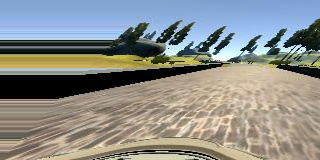
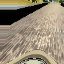
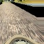
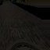

# Behavioral Cloning - Project 3


## Overview

In this project, our goal is to  train a  car  in a simulated environment by cloning the behavior as seen during training mode. Here we're leveraging TensorFlow and Keras, a deep learning network predicts the proper steering angle given training samples.

## Installation & Resources
1. Anaconda Python 3.5
2. Udacity [Carnd-term1 starter kit](https://github.com/udacity/CarND-Term1-Starter-Kit) with miniconda installation
3. Udacity Car Simulation on [Window x64](https://d17h27t6h515a5.cloudfront.net/topher/2016/November/5831f3a4_simulator-windows-64/simulator-windows-64.zip)
4. Udacity [sample data](https://d17h27t6h515a5.cloudfront.net/topher/2016/December/584f6edd_data/data.zip)

## Files
* `model.py` - The script used to create and train the model.
* `drive.py` - The script to drive the car.
* `model.json` - The model architecture.
* `model.h5` - The model weights.

### Quickstart
**1. Control the car movement by key-board of PC**

:arrow_up: accelerate :arrow_down: brake :arrow_left: steer left :arrow_right: steer right

**2. Two driving modes:**
- Training: For user to take control over the car
- Autonomous: For car to drive by itself

**3. Collecting data:**
User drives on track 1 and collects data by recording the driving experience by toggle ON/OFF the recorder. Data is saved as frame images and a driving log which shows the location of the images, steering angle, throttle, speed, etc.
Another option is trying on Udacity data sample.

## Network

### Implementation approach : 


Here our goal is to predict the steering angle from the image captured by the cameras of the car . We're trying to map the image  pixel data from the camera to the steering angle  . It's a regression problem as we're predicting a continuous value .

I started with a simple multi layer neural network to with 3 convolution layers and 2 fully connected layers . However it couldn't generalise the prediction as i was expecting.
A significant amount of time was spent on exploring several different neural network archictectures. The two that I looked into was the Nvidia architecture suggested in their paper and the comma.ai steering model.
I took a look at the solution documented in the [NVIDIA Paper, in which raw pixels are mapped steering commands. Because of the similarity of the use case  I decided it would be a good starting point.

The Nvidia architecture is small compared and little complex architectures at start with only 9 layers.After experimenting with a rough replication of the network, I found that I could train relatively fast, and because of this, I decided that did not need transfer learning to complete this project, opting to stick with the simpler Nvidia network.

After getting the initial network running, I experimented with different dropout layers and activation functions.  

For activations, I read a [Paper on ELU Activations](https://arxiv.org/pdf/1511.07289v1.pdf), which led me to experiment, comparing the training time and loss for RELU vs ELU activations.  After several trials I concluded that ELUs did  give marginally faster performance and lower loss.  ELU activations offer the same protection against vanishing gradiant as RELU, and in addition, ELUs have negative values, which allows them to push the mean activations closer to zero, improving the efficiency of gradient descent.Which is the important ascpect of my experiment.

For dropout, I ran trials with values between 0.2 and 0.5 for fraction of inputs to drop, as well as which layers to include a dropout operation.  I found that my model performed poorly in autonomous mode when including dropout layers in the final fully connected layers.My intuition here is that dropout may not be appropriate for every layer in regression problems. What i learned from various sources that,
    In classification problems : We are only concerned softmax probabilities relative to another class, so even if dropout effects the final value, it should not matter because we only care about the value relative to other classes.
    In regression prioblems: We care about the final value, so dropout might have negative effects.
    To address the above issues , I chose L2 regularization in the fully connected layers. ( Initially, this prevented the model from producing sharp turns, but was fixed after reducing the weight penalty. )

### Architecture

My architecture is modeled after the network depicted in [NVIDIA Paper](http://images.nvidia.com/content/tegra/automotive/images/2016/solutions/pdf/end-to-end-dl-using-px.pdf).
The architecture is a traditional "feed-foward" layered architecture in which the output of one layer is fed to the layer above.
At a high level the network consists of preprocessing layers, 5 convolutional layers, followed by 3 fully connected layers, and a final output layer.
Since we are working with a regression problem, the output layer is a single continuous value, as apposed to the softmax probabilities used for classification tasks such as traffic sign identification.

Before the first convolutional layer, a small amount of preprocessing takes place within the pipeline.  This includes pooling  and batch normalization.

Each convolitional has a 1x1 stride, and uses a 2x2 max pooling operation to reduce spatial resolution. The first three convolutional layers use a 5x5 filter, while the final two use a 3x3 filter as the input dimensionality is reduced.

For regularization, a spatial dropout operation is added after each convolutional layer.  Spatial dropout layers drop entire 2D features maps instead of individual features.

For non-linearity, ELU activationd are used for each convolutional, as well as each fully connected layer.

The output from the forth convolutional layer is flattened and fed into a regressor composed of four fully connected layers.  The fully connected layers each reduce the number of features with the final layer outputting a single continuous value.  As noted above, l2 regularization is leveraged in the fully connected layers.


| Layer (type)                                |  Output Shape           |    Param #        |  Connected to                     
|---------------------------------            |-------------------      |--------------     |------------------------- 
| maxpooling2d_1 (MaxPooling2D)               | (None, 40, 160, 3)      |  0                | maxpooling2d_input_1[0][0]             
| batchnormalization_1 (BatchNormalisation)   | (None, 40, 160, 3)      |  160              | maxpooling2d_1[0][0]                  
| convolution2d_1 (Convolution2D)             | (None, 40, 160, 24)     |  1824             | batchnormalization_1[0][0]           
| maxpooling2d_2 (MaxPooling2D)               | (None, 20, 80, 24)      |  0                | convolution2d_1[0][0]               
| spatialdropout2d_1 (SpatialDropout)         | (None, 20, 80, 24)      |  0                | maxpooling2d_2[0][0]             
| convolution2d_2 (Convolution2D)             | (None, 20, 80, 36)      |  21636            | spatialdropout2d_1[0][0]                      
| maxpooling2d_3 (MaxPooling2D)               | (None, 10, 40, 36)      |  0                | convolution2d_2[0][0]           
| spatialdropout2d_2 (SpatialDropout)         | (None, 10, 40, 36)      |  0                | maxpooling2d_3[0][0]                
| convolution2d_3 (Convolution2D)             | (None, 10, 40, 48)      |  43248            | spatialdropout2d_2[0][0]            
| maxpooling2d_4 (MaxPooling2D)               | (None, 5, 20, 48)       |  0                | convolution2d_3[0][0]               
|spatialdropout2d_3 (SpatialDropout)          | (None, 5, 20, 48)       |  0                | maxpooling2d_4[0][0]                 
|convolution2d_4 (Convolution2D)              | (None, 5, 20, 64)       |  27712            | spatialdropout2d_3[0][0]                    
| maxpooling2d_5 (MaxPooling2D)               | (None, 3, 10, 64)       |  0                | convolution2d_4[0][0]                     
| spatialdropout2d_4 (SpatialDropout)         | (None, 3, 10, 64)       |  0                | maxpooling2d_5[0][0]                
| convolution2d_5 (Convolution2D)             | (None, 3, 10, 64)       |  36928            | spatialdropout2d_4[0][0]                  
|maxpooling2d_6 (MaxPooling2D)                | (None, 2, 5, 64)        |  0                | convolution2d_5[0][0]  
| batchnormalization_2 (BatchNormalisation)   | (None, 2, 5, 64)        |  8                | maxpooling2d_6[0][0]
| spatialdropout2d_5 (SpatialDropout)         | (None, 2, 5, 64)        |  0                | batchnormalization_2[0][0]
| flatten_1 (Flatten)                         | (None, 640)             |  0                | spatialdropout2d_5[0][0] 
| dense_1 (Dense)                             | (None, 100)             |  64100            | flatten_1[0][0]
| dense_2 (Dense)                             | (None, 50)              |  5050             | dense_1[0][0] 
| dense_3 (Dense)                             | (None, 10)              |  510              | dense_2[0][0]
| dense_4 (Dense)                             | (None, 1)               |  11               | dense_3[0][0]    
||||
| Total params: 201,187
| Trainable params: 201,103
| Non-trainable params: 84

See the diagram below.  This diagram is modified from the original source diagram found in the the [NVIDIA Paper](http://images.nvidia.com/content/tegra/automotive/images/2016/solutions/pdf/end-to-end-dl-using-px.pdf).
The values have been modified to represent input sizes of our recorded training data and to include the additional preprocessing layers.


## Training dataset collection and augmentation 

In my opinion this project truly highlights the importance of choosing proper training data as the model is very sensitive to the training data choice.
In the begining I spent over a week collecting my own training data using keyboard and mouse across track 1 and track 2. With the data I collected my model was able to run for a little bit till it deviate the track drastically.
It did not correctly record the correct maneuvers the model should make to recover from the edges of the road.
To overcome this , I started augmenting data on the existing data provided by Udacity using several techniques, as shown below. Original Sample:


+ Shearing


+ Cropping


+ Flipping


+ Adjusting Brightness 



Below histogram represents the distribution of steering angles in the training data .


I have observed when there is sharp change in brightness and the curvature of the track , Car is tending to go off the road .To avoid this we capture the images for the similar incidents and add more data for the training by moving the car back to the track .

A trained model is able to predict a steering angle given a camera image.  But, before sending our recorded images and steering angle data into the network for training, we can improve performance by limiting how much data is stored in memory as well as image preprocessing.


### Image Generator

The entire set of images used for training would consume a large amount of memory.  A python generator is leveraged so that only a single batch is contained in memory at a time.

### Image Preprocessing


First the image is cropped above the horizon to reduce the amount of information the network is required to learn.  Next the image is resized to further reduce required processing.  Finally normalization is applied to each mini-batch.  This helps keep weight values small, improving numerical stability. In addition since our mean is relatively close to zero, the gradient descent optimization will have less searching to do when minimizing loss.

### Network Output

Once the network is trained, the model definition as well as the trained weights are saved so that the autonomous driving server can reconstruct the network and make predictions given the live camera stream.

Now we can run the simulator in autonomous mode and start the driver server.

```
python drive.py model.json
```

The autonomous driving server sends predicted steering angles to the car using the trained network.  Here we can test how well the model performs.  If the car makes mistakes, we return to training mode to collect more training data.

The final output is also added into git repo: output_video.mp4


References:

Very useful blogs:
https://chatbotslife.com/using-augmentation-to-mimic-human-driving- 496b569760a9#.dbqop5p5v
https://medium.com/@mohankarthik/cloning-a-car-to-mimic-human-driving- 5c2f7e8d8a #.os34njl0h

Nvidia architecture:
https://arxiv.org/pdf/1604.07316v1.pdf
http://images.nvidia.com/content/tegra/automotive/images/2016/solutions/pdf/end-to-end-dl-using-px.pdf)

Comma.ai steering model
https://github.com/commaai/research/blob/master/view_steering_model.py


