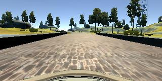

# Behavioral Cloning - Project 3


## Overview

In this project, our goal is to  train a  car  in a simulated environment by cloning the behavior as seen during training mode. Here we're leveraging TensorFlow and Keras, a deep learning network predicts the proper steering angle given training samples.

## Installation & Resources
1. Anaconda Python 3.5
2. Udacity [Carnd-term1 starter kit](https://github.com/udacity/CarND-Term1-Starter-Kit) with miniconda installation
3. Udacity Car Simulation on [Window x64](https://d17h27t6h515a5.cloudfront.net/topher/2016/November/5831f3a4_simulator-windows-64/simulator-windows-64.zip)
4. Udacity [sample data](https://d17h27t6h515a5.cloudfront.net/topher/2016/December/584f6edd_data/data.zip)

## Files
* `model.py` - The script used to create and train the model.
* `drive.py` - The script to drive the car.
* `model.json` - The model architecture.
* `model.h5` - The model weights.

### Quickstart
**1. Control the car movement by key-board of PC**

:arrow_up: accelerate :arrow_down: brake :arrow_left: steer left :arrow_right: steer right

**2. Two driving modes:**
- Training: For user to take control over the car
- Autonomous: For car to drive by itself

**3. Collecting data:**
User drives on track 1 and collects data by recording the driving experience by toggle ON/OFF the recorder. Data is saved as frame images and a driving log which shows the location of the images, steering angle, throttle, speed, etc.
Another option is trying on Udacity data sample.

## Network

### Implementation approach : 


Here our goal is to predict the steering angle from the image captured by the cameras of the car . We're trying to map the image  pixel data from the camera to the steering angle  . It's a regression problem as we're predicting a continuous value .

I started with a simple multi layer neural network to with 3 convolution layers and 2 fully connected layers . However it couldn't generalise the prediction as i was expecting.

A significant amount of time was spent on exploring several different neural network archictectures. The two that I looked into was the Nvidia architecture suggested in their paper and the comma.ai steering model.

I took a look at the solution documented in the [NVIDIA Paper, in which raw pixels are mapped steering commands. Because of the similarity of the use case  I decided it would be a good starting point.

The Nvidia architecture is small compared and little complex architectures at start with only 9 layers.After experimenting with a rough replication of the network, I found that I could train relatively fast, and  to stick with the simpler Nvidia network.

After getting the initial network running, I experimented with different dropout layers and activation functions.  


### Architecture

My architecture is modeled after the network depicted in [NVIDIA Paper](http://images.nvidia.com/content/tegra/automotive/images/2016/solutions/pdf/end-to-end-dl-using-px.pdf).

The design of the network is based on [the NVIDIA model](https://devblogs.nvidia.com/parallelforall/deep-learning-self-driving-cars/), which has been used by NVIDIA for the end-to-end self driving test.  As such, it is well suited for the project.

It is a deep convolution network which works well with supervised image classification / regression problems.  As the NVIDIA model is well documented, I was able to focus how to adjust the training images to produce the best result with some adjustments to the model to avoid overfitting and adding non-linearity to improve the prediction.

I've added the following adjustments to the model.

- I used Image normalization and Image Cropping as the first layers and batch normalization layer to each convolution based to improve the learning on the following:Sergey Ioffe and (2015). Batch Normalization: Accelerating Deep Network Training by Reducing. CoRR, abs/1502.03167.
- I used Lambda layer to normalized input images to avoid saturation and make gradients work better.
- I've added an additional dropout layer to avoid overfitting after the convolution layers.
- I've also included RELU for activation function for every layer except for the output layer to introduce non-linearity.

In the end, the model looks like as follows:

- Image normalization
- Convolution: 5x5, filter: 24, strides: 2x2, activation: relu
- Convolution: 5x5, filter: 36, strides: 2x2, activation: relu
- Convolution: 5x5, filter: 48, strides: 2x2, activation: relu
- Convolution: 3x3, filter: 64, strides: 1x1, activation: relu
- Convolution: 3x3, filter: 64, strides: 1x1, activation: relu
- Drop out (0.5)
- Fully connected: neurons: 100
- Fully connected: neurons:  50
- Fully connected: neurons:  10
- Fully connected: neurons:   1 (output)

As per the NVIDIA model, the convolution layers are meant to handle feature engineering and the fully connected layer for predicting the steering angle.  However, as stated in the NVIDIA document, it is not clear where to draw such a clear distinction.  Overall, the model is very functional to clone the given steering behavior.


## Training dataset collection and augmentation 

In my opinion this project truly highlights the importance of choosing proper training data as the model is very sensitive to the training data choice.
In the begining I spent over a week collecting my own training data using keyboard and mouse across track 1 and track 2. With the data I collected my model was able to run for a little bit till it deviate the track drastically.
It did not correctly record the correct maneuvers the model should make to recover from the edges of the road.
To overcome this , I started augmenting data on the existing data provided by Udacity using several techniques, as shown below. Original Sample:



+ Shearing


+ Cropping


+ Flipping


+ Adjusting Brightness 


Below histogram represents the distribution of steering angles in the training data .


I have observed when there is sharp change in brightness and the curvature of the track , Car is tending to go off the road .To avoid this we capture the images for the similar incidents and add more data for the training by moving the car back to the track .

A trained model is able to predict a steering angle given a camera image.  But, before sending our recorded images and steering angle data into the network for training, we can improve performance by limiting how much data is stored in memory as well as image preprocessing.


### Image Generator

The entire set of images used for training would consume a large amount of memory.  A python generator is leveraged so that only a single batch is contained in memory at a time.

### Image Preprocessing


First the image is cropped above the horizon to reduce the amount of information the network is required to learn.  Next the image is resized to further reduce required processing.  Finally normalization is applied to each mini-batch.  This helps keep weight values small, improving numerical stability. In addition since our mean is relatively close to zero, the gradient descent optimization will have less searching to do when minimizing loss.

### Network Output

Once the network is trained, the model definition as well as the trained weights are saved so that the autonomous driving server can reconstruct the network and make predictions given the live camera stream.

Now we can run the simulator in autonomous mode and start the driver server.

```
python drive.py model.json
```

The autonomous driving server sends predicted steering angles to the car using the trained network.  Here we can test how well the model performs.  If the car makes mistakes, we return to training mode to collect more training data.


References:

Very useful blogs:
https://chatbotslife.com/using-augmentation-to-mimic-human-driving- 496b569760a9#.dbqop5p5v
https://medium.com/@mohankarthik/cloning-a-car-to-mimic-human-driving- 5c2f7e8d8a #.os34njl0h

Nvidia architecture:
https://arxiv.org/pdf/1604.07316v1.pdf
http://images.nvidia.com/content/tegra/automotive/images/2016/solutions/pdf/end-to-end-dl-using-px.pdf)

Comma.ai steering model
https://github.com/commaai/research/blob/master/view_steering_model.py


